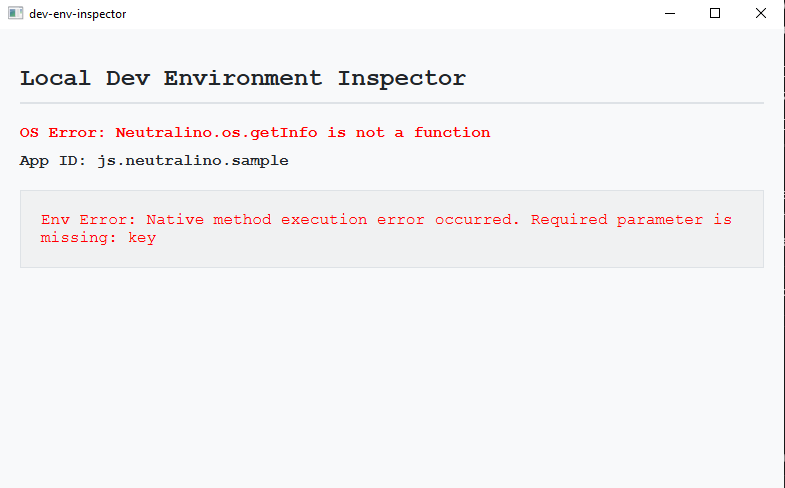

# Local Dev Environment Inspector (Neutralinojs)

A lightweight desktop application built with Neutralinojs to instantly inspect your local development environment. It provides a clean, developer-focused interface to view OS details, application metadata, and system-wide environment variables with built-in clipboard support.

## What it does
- Fetches and displays system-level OS information (Name, Version).
- Surfaces application-specific metadata directly from the config.
- Lists all available system environment variables in a scrollable view with one-click copy functionality.

## APIs Used
- `computer.getOSInfo`: Fetches system-wide operating system details.
- `os.getEnvs`: Retrieves all system environment variables as an object.
- `app.getConfig`: Accesses the application's configuration parameters.
- `clipboard.writeText`: Handles copying data to the system clipboard.

## Demo

